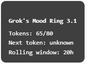

# gmoodring
## Grok’s Mood Ring (gmoodring)

gmoodring is a lightweight TamperMonkey userscript that adds a floating, draggable “mood ring” to Grok.com.  
It shows your real-time rate‑limit status, token countdown, and rolling‑window behavior — something the site itself doesn’t expose.

Built especially for free‑tier users who keep running into mysterious 429 errors during long chats or story sessions.

### Features
- Live display of remaining tokens and total window size  
- Second‑by‑second countdown to the next token  
- Smart detection of rolling‑window token returns  
- Automatic UI nudge when Grok’s frontend gets stuck after a 429  
- Gentle polling to avoid backend throttling  
- Draggable, compact floating widget  
- Zero interference with Grok’s normal UI  

### Why “Mood Ring”?
Because the widget tells you exactly how Grok.com is feeling — calm, cranky, or exhausted — based on your token usage.

the UI looks like this:

## Installation

1. Install **TamperMonkey** in your browser.
2. Open the raw `gmoodring.user.js` file from this repo in your browser.
3. TamperMonkey will detect it automatically and prompt: **“Install userscript?”**
4. Click **Install**.
5. Go to any Grok chat page (`https://grok.com/c/*`) and you should see **Grok’s Mood Ring** in the bottom‑right corner.
